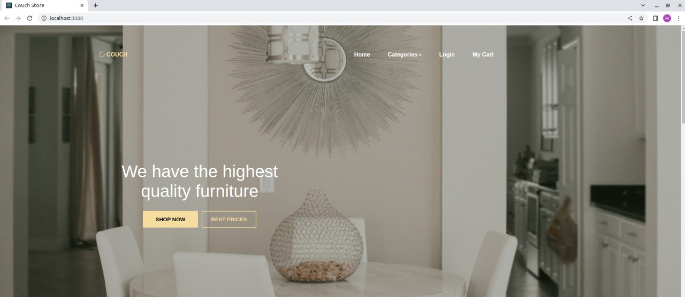
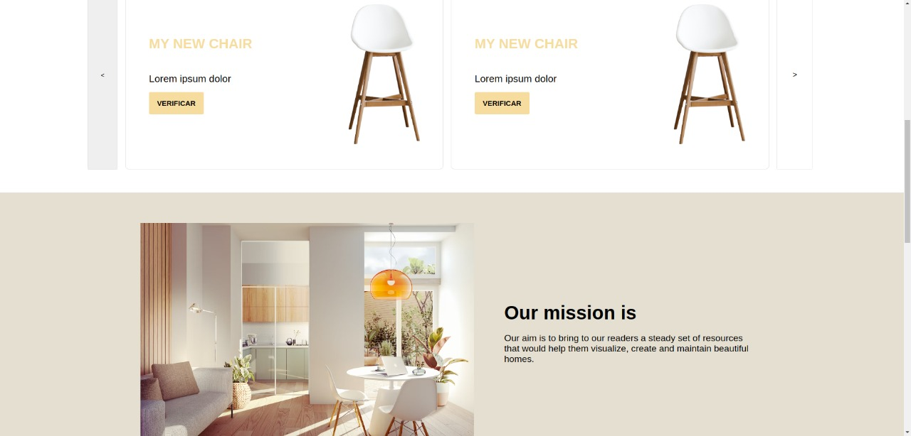
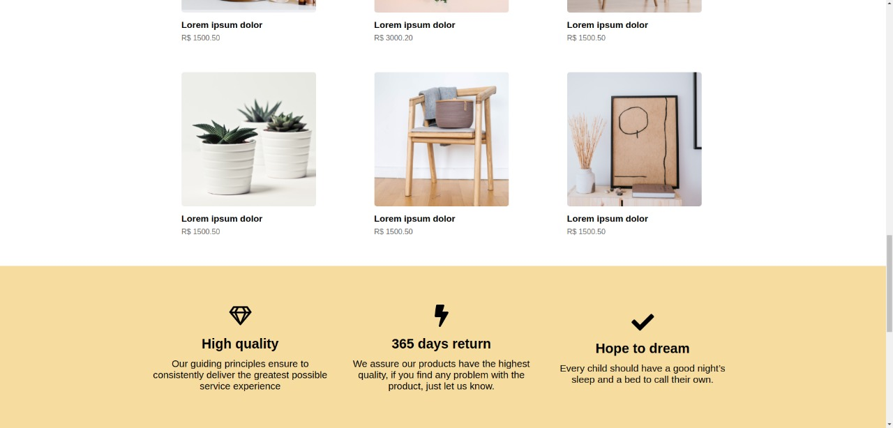
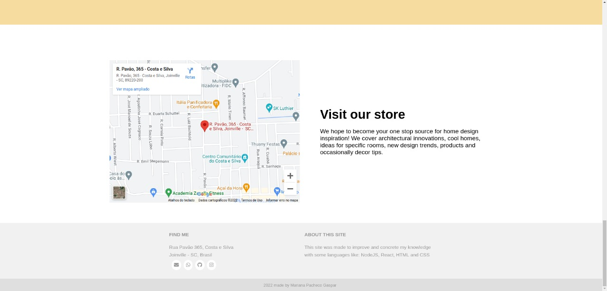
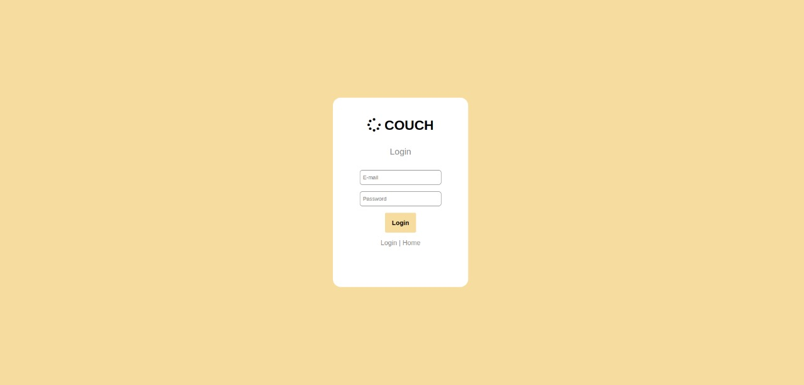
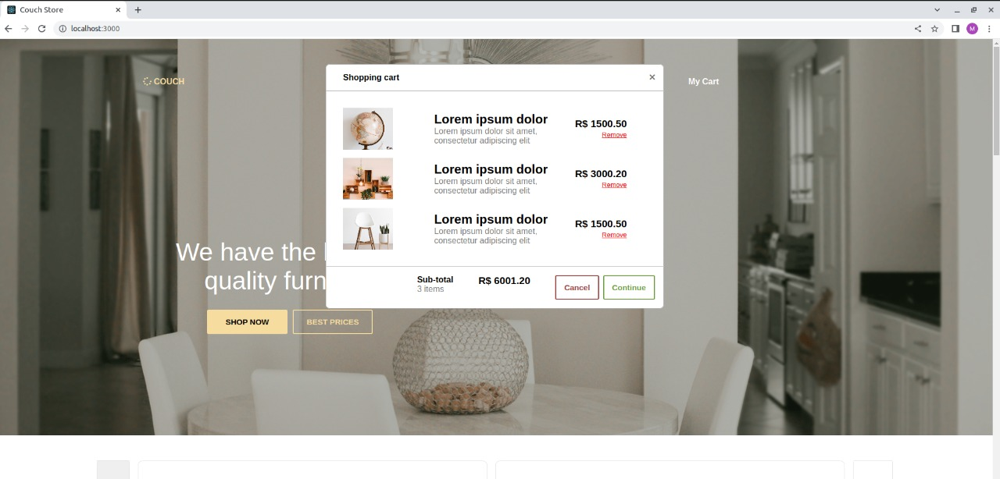
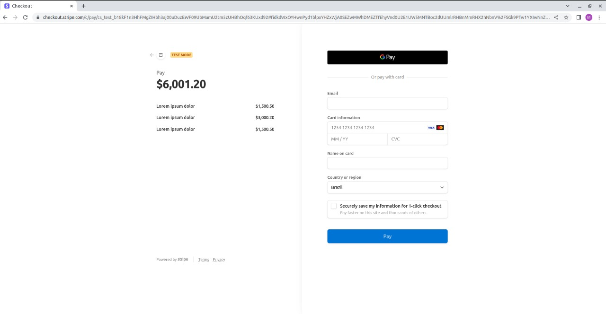

# Couch-store
> A demo website for a furniture store that provides a login and checkout for the payment. This site was made to improve and concrete my knowledge
with some languages like: NodeJS, React, HTML and CSS

## Table of Contents
* [General Info](#general-information)
* [Technologies Used](#technologies-used)
* [Screenshots](#screenshots)
* [Setup](#setup)

## What does the website provide?
- Categories and products list
- Store's information
- Login system
- Shopping cart
- Checkout payment

## Technologies Used
- Javascript
- Node v12
- Express.js
- React.js
- Mysql
- Stripe API

## Screenshots

## Setup
After clone the project, you must create your .env file at server folder. You can follow the .env_example and put your own credentials.
Then you have to import the database placed at the server folder, with the name "couch_store_db.sql".
If you already have node and npm installed, you can install the server and client project using 

    npm install

And then run npm start on server and client folder.
Now you're ready.